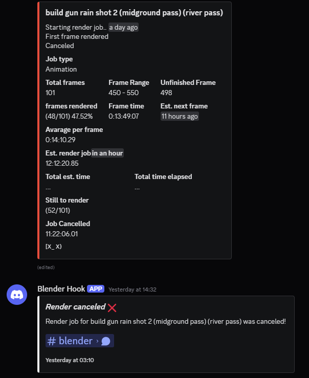

# 🛎️ Render Notifications – Blender Extension


> ⚠️ Note: Render Notifications has been upgraded to use the Blender Extensions system, introduced in Blender 4.1+.
> If you're want the legacy add-on version, then check out the [legacy-addon](https://github.com/JimmyNos/Render-Notifications/tree/old_addon_branch) branch.
> [v1.0.0](https://github.com/JimmyNos/Render-Notifications/releases/tag/v1.0.0) was the final release using the legacy add-on system
> 
**Render Notifications** is a Blender extention that sends notifications when a render **starts**, **finishes**, or gets **cancelled** using **Discord**, **desktop notifications**, or **webhooks** for custom platforms like **Home Assistant**.

Blender does not expose render progress or time directly to Python, so this add-on calculates the following after each frame:
- Render time
- Average time per frame
- Estimated total render time
- Frames remaining and percentage complete

---

## ✨ Features

### 🔔 🖥️ Desktop Notifications

  - Sends desktop notifications when a render:
    - Starts
    - Finishes
    - Gets canceled
    - Completes the first frame
  - Includes:
    - Time taken to render
    - Estimated total time for full render
  - Supports custom notification sounds (`.wav` format)
    
### 💬 Discord Webhook Integration

  - Sends a message to Discord when the render starts, and edits it as rendering progresses.
    - when the render finishes or get canceled, a second message is sent.
  - Supports preview images:
    - For single-frame renders: shows the final image
    - For animation jobs: shows the first and last frame
> ⚠️ **Note**: Previews rely on saving as `.png`. Formats like `.exr` are not supported for preview extraction.

### 🌐 Webhook Support
- Sends structured **JSON payloads** to your custom apps or third-party services (e.g. Home Assistant).
- Perfect for integrations with mobile alerts, dashboards, or automation workflows.

## 🧩 Installation
1. Download the latest version of the extension as a `.zip` file.
2. In Blender, go to **Edit > Preferences > Get Extentions**.
3. Click **Install from disk** and select the **.zip** file.
4. Blender will then install the extension and a new Notifications section will appear in the Render Properties tab.

## 🔧 Configuration
### ⚙️ Setup
1. Desktop Notifications
   - Enable the custom sound option (optional).
   - Attach your `.wav` file location.
2. Discord Webhook Settings
   - Set a **custom name** (optional).
   - Paste your **Discord webhook URL**.
     - Note: Get the Discord webhook via your channel settings.
   - You can define a **custom render preview save path**:
     - In either the **Preferences** or **Render Properties** tab.
     - If the path in Render Properties is invalid, the Preferences path will be used instead.
3. Webhook Notifications
   - Paste your **custom webhook URL** (e.g. for Home Assistant).
4. Render Properties Panel
   - You’ll find a new **Notifications** section.
   - Choose your notification options:
     - Desktop
     - Discord
       - Choose to send previews
     - Webhook
   - Choose when to be notified: Start, Cancel, First Frame, Completion
   
  

## 📷 Notification Examples

### 🖥️ Desktop Notification

> Examples of local desktop notifications.


### 💬 Discord Webhook Message

> Examples of Discord messages sent with optional a preview image.

**Start Notification**


**Rendering**


**Render Completion**


**Render Cancelled**




### 🌐 Webhook Integration (e.g. Home Assistant)

> Examples of mobile notifications sent via homeassistant.
> Homeassisstant automation yaml files can be found in the tmepletes folder. Replace `your_device_id_here` with your actual **mobile device id**. Which to ui mode in automations and you should be able to search and select you device.


---

## 🔄 JSON Payload Examples

### Still Render
```
{
  "call_type": "complete",
  "project_name": "Untitled",
  "total_frames": 6,
  "frame": 115,
  "job_type": "Still",
  "total_time_elapsed": "0:00:00.69"
}
```
### Initial Render Start
```
{
  "call_type": "render_init",
  "project_name": "Untitled",
  "total_frames": 6,
  "frame": 0,
  "job_type": "Animation",
  "frame_range": "0 - 5",
  "Total_frames_to_render": 6
}
```
### After Each Frame Renders
```
{
  "call_type": "render_post",
  "project_name": "Untitled",
  "total_frames": 6,
  "frame": 4,
  "job_type": "Animation",
  "frame_range": "0 - 5",
  "Total_frames_to_render": 6,
  "RENDER_FIRST_FRAME": "0:00:01.05",
  "est_render_job": "0:00:00.75",
  "frames_left": "1",
  "frames_rendered": 5,
  "rendered_frames_percentage": 83.33,
  "countdown": "<t:1750442376:R>",
  "next_frame_countdown": "<t:1750442375:R>",
  "average_time": "0:00:00.80",
  "RENDER_CURRENT_FRAME": "0:00:00.75"
}
```
### On Completion
```
{
  "call_type": "complete",
  "project_name": "Untitled",
  "total_frames": 6,
  "frame": 5,
  "job_type": "Animation",
  "frame_range": "0 - 5",
  "Total_frames_to_render": 6,
  "RENDER_FIRST_FRAME": "0:00:01.05",
  "est_render_job": "0:00:00.74",
  "frames_left": "0",
  "frames_rendered": 6,
  "rendered_frames_percentage": 100.0,
  "countdown": "<t:1750442376:R>",
  "next_frame_countdown": "<t:1750442376:R>",
  "average_time": "0:00:00.79",
  "RENDER_CURRENT_FRAME": "0:00:00.74",
  "total_time_elapsed": "0:00:05.14",
  "total_Est_time": "0:00:06.30"
}
```

# 📜 License
This project is licensed under the GNU General Public License v3 (GPLv3).

# 🙋‍♂️ Author
Made with ☕ and 🧠 by Michael Mosako.
Consider [buying me a coffee](https://buymeacoffee.com/jimmynostar).
Check out my animations on YouTube: [YouTube Channel](https://www.youtube.com/@JimmyNoStar).
